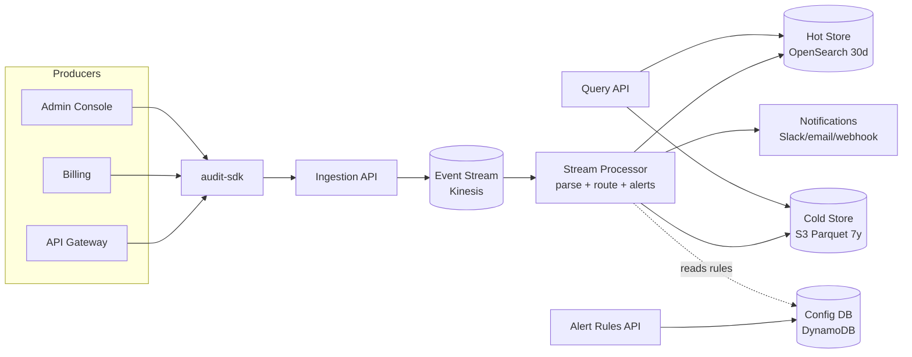

# Audit Trail System — High-Level Overview
---

## What it does

Captures structured events ("who did what, when, where") from many services,
stores them, lets people search them, and fires alerts on suspicious patterns.

The flow is always the same:

```
service -> ingest -> stream -> store -> query
                        |
                        +--> alert engine -> notify
```

---

## 1. High-level architecture



**In words:**

1. Every service uses a tiny **SDK** to emit events.
2. The **Ingestion API** authenticates, validates, and drops events into a **stream**.
3. A **Stream Processor** reads the stream once and does three things in parallel:
   write to the **Hot Store** (fast search), write to the **Cold Store** (cheap long-term), and evaluate **alert rules** (notify on match).
4. The **Query API** serves searches — recent data from Hot, older data from Cold.
5. The **Alert Rules API** lets users manage what to alert on; rules live in the **Config DB**.

---

## 2. Major service interfaces

Just the types and signatures — implementations are out of scope.

### Core event

```typescript
type AuditEvent = {
  eventId: string;        // unique, for idempotency
  requestId: string;       // whole flow id
  timestamp: string;      // when it happened
  source: string;  (identity/entity)       // which service emitted it
  user: { type: "user" | "service"; };
  message?: type: string;
  severity: "info" | "warn" | "critical";
  metadata: Record<string, unknown>;
  accountId: string;
};
```

### Ingestion

```typescript
interface IIngestionService {
  ingest(events: AuditEvent[], ctx: AuthContext): Promise<IngestAck>;
}

interface IEventValidator {
  validate(e: AuditEvent): { ok: boolean; errors?: string[] };
}
```

### Stream processing

```typescript
interface IStreamProcessor {
  // Reads a batch from the stream and fans out to stores + alert engine.
  process(batch: AuditEvent[]): Promise<void>;
}

interface IEventWriter {
  writeHot(events: AuditEvent[]): Promise<void>;   // OpenSearch
  writeCold(events: AuditEvent[]): Promise<void>;  // S3 Parquet
}
```

### Query

```typescript
// Mirrors AuditEvent: every filter targets a field that exists on the event,
// using the same type unions. tenantId is NOT in the query — it comes from auth.
type AuditQuery = {
  from: string;           // ISO-8601, required (matches AuditEvent.timestamp)
  to: string;             // ISO-8601, required
  filters?: {
    source?: string | string[];                              // AuditEvent.source
    actorType?: "user" | "service";                          // AuditEvent.actor.type
    actorId?: string;                                        // AuditEvent.actor.id
    actorIp?: string;                                        // AuditEvent.actor.ip
    action?: string | string[];                              // AuditEvent.action
    resourceType?: string;                                   // AuditEvent.resource.type
    resourceId?: string;                                     // AuditEvent.resource.id
    outcome?: "success" | "failure";                         // AuditEvent.outcome
    severity?: Array<"info" | "warn" | "critical">;          // AuditEvent.severity
  };
  q?: string;             // free-text on action + metadata
  cursor?: string;        // opaque pagination cursor
  limit?: number;         // default 100, max 1000
};

interface IQueryService {
  search(tenantId: string, q: AuditQuery): Promise<Page<AuditEvent>>;
  getById(tenantId: string, eventId: string): Promise<AuditEvent | null>;
  export(tenantId: string, q: AuditQuery): Promise<ExportJob>;
}
```

### Alerts

```typescript
interface IAlertRule {
  id: string;
  tenantId: string;
  name: string;
  enabled: boolean;
  match: {
    filter: Partial<AuditQuery["filters"]>;
    window: { durationSec: number; minCount: number };
  };
  notify: NotificationTarget[];
}

type NotificationTarget =
  | { kind: "webhook"; url: string }
  | { kind: "email"; to: string[] }
  | { kind: "slack"; webhookUrl: string };

interface IAlertEngine {
  // Called by the stream processor for each batch.
  evaluate(batch: AuditEvent[]): Promise<AlertTriggered[]>;
}

interface IAlertRuleStore {
  list(tenantId: string): Promise<IAlertRule[]>;
  upsert(rule: IAlertRule): Promise<IAlertRule>;
  delete(tenantId: string, ruleId: string): Promise<void>;
}
```

---

## 3. API outlines

All endpoints under `/v1`. Auth required; tenant comes from the auth token (clients never pass `tenantId`).

### Ingestion

| Method | Path | Purpose |
|---|---|---|
| `POST` | `/v1/events` | Send one event |
| `POST` | `/v1/events:batch` | Send up to 500 events |

```http
POST /v1/events
{
  "eventId": "01HXYZ...",
  "action": "user.login",
  "actor": { "type": "user", "id": "u_123" },
  "outcome": "success",
  "severity": "info",
  "metadata": { "mfa": true }
}

202 Accepted   { "accepted": 1, "rejected": [] }
```

### Querying

| Method | Path | Purpose |
|---|---|---|
| `GET` | `/v1/events` | Search with filters |
| `GET` | `/v1/events/{eventId}` | Fetch one event |
| `POST` | `/v1/exports` | Async export job |
| `GET` | `/v1/exports/{jobId}` | Poll export status |

```http
GET /v1/events?from=2026-05-01&to=2026-05-18&actorId=u_123&action=user.login

200 OK
{ "items": [ {...}, {...} ], "nextCursor": "abc..." }
```

The Query API picks the right store automatically:
recent range → Hot (OpenSearch); old range → Cold (Athena over S3).

### Alert rules

| Method | Path | Purpose |
|---|---|---|
| `GET` | `/v1/alert-rules` | List rules |
| `POST` | `/v1/alert-rules` | Create rule |
| `GET` | `/v1/alert-rules/{id}` | Get rule |
| `PATCH` | `/v1/alert-rules/{id}` | Update rule |
| `DELETE` | `/v1/alert-rules/{id}` | Delete rule |
| `POST` | `/v1/alert-rules:simulate` | Dry-run on past data, no notifications |

```http
POST /v1/alert-rules
{
  "name": "5+ failed logins in 1 min",
  "match": {
    "filter": { "action": "user.login", "outcome": "failure" },
    "window": { "durationSec": 60, "minCount": 5 }
  },
  "notify": [{ "kind": "slack", "webhookUrl": "https://..." }]
}
```

---

## 4. Storage and indexing model

Two main stores plus a small config DB. Each is picked for what it's good at.

| Tier | Tech | Retention | Used for |
|---|---|---|---|
| **Hot** | OpenSearch | 30 days | Interactive search, alert evaluation, recent dashboards |
| **Cold** | S3 (Parquet) + Athena | 7 years | Compliance, historical lookups, exports |
| **Config** | DynamoDB | n/a | Tenants, alert rules, API keys |

### Hot Store — OpenSearch

- **Index pattern**: `audit-{tenantBucket}-{YYYY.MM.DD}`
  Tenants are grouped into buckets so we don't create one index per tenant per day (would blow up the cluster at 1000s of tenants).
- **Always filter by `tenantId`** — enforced in every query, never user-supplied.
- **Field types**: `tenantId`, `actor.id`, `action`, `source`, `severity`, `outcome` are all `keyword`; `timestamp` is `date`; `metadata` is `flattened`.
- **Effective lookup paths** (what queries are fast):
  - `(tenantId, timestamp)` — time range
  - `(tenantId, actor.id, timestamp)` — "what did this user do?"
  - `(tenantId, action, timestamp)` — "all logins last hour"
- **Lifecycle**: rollover every day, force-merge after 1 day, delete after 30 days.

### Cold Store — S3 Parquet + Athena

- **Layout**: `s3://audit/tenantId=<id>/year=<yyyy>/month=<MM>/day=<dd>/file.parquet`
- **Written by** Kinesis Firehose with dynamic partitioning on `tenantId` and date.
- **Queried by** Athena (SQL); partition pruning by `tenantId` + date range keeps scans cheap.
- **Cold lifecycle**: S3 moves objects to Glacier Deep Archive after 1 year, deletes after 7 years.

### Config DB — DynamoDB

Tiny compared to events, but needs fast point reads.

| Table | Primary key | Stores |
|---|---|---|
| `Tenants` | `tenantId` | Tenant config, rate limits |
| `IngestKeys` | `tenantId` + `keyId` | API keys (hashed) |
| `AlertRules` | `tenantId` + `ruleId` | Alert rules |
| `ExportJobs` | `tenantId` + `jobId` | Export status, TTL 7d |

### Why this split

| Need | Goes to | Why |
|---|---|---|
| "Last hour of failed logins" | Hot | Athena too slow |
| "All 2024 events for compliance" | Cold | OpenSearch too expensive at 1y |
| "Tenant config / alert rules" | Config | Needs single-row reads, not search |

---

## TL;DR

- **One API in, one API out, one stream in the middle.**
- The stream **fans out** to a fast store, a cheap store, and an alert engine.
- **Tenant isolation** is enforced on every layer: auth → stream key → index name → S3 prefix.
- Hot for "last 30 days fast," Cold for "7 years cheap," DynamoDB for config.
- Everything else (parsing, enrichment, fancy alert types, live tail, tiered routing) is an extension of this skeleton — see [audit-trail-system.md](audit-trail-system.md) for the full Coralogix-shaped design.
