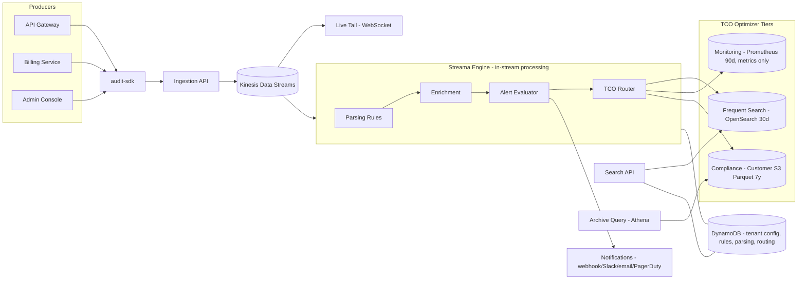
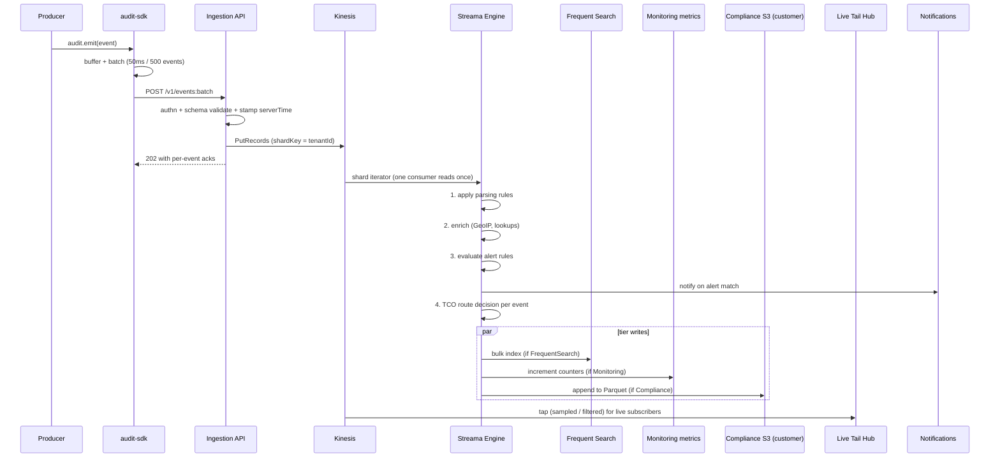
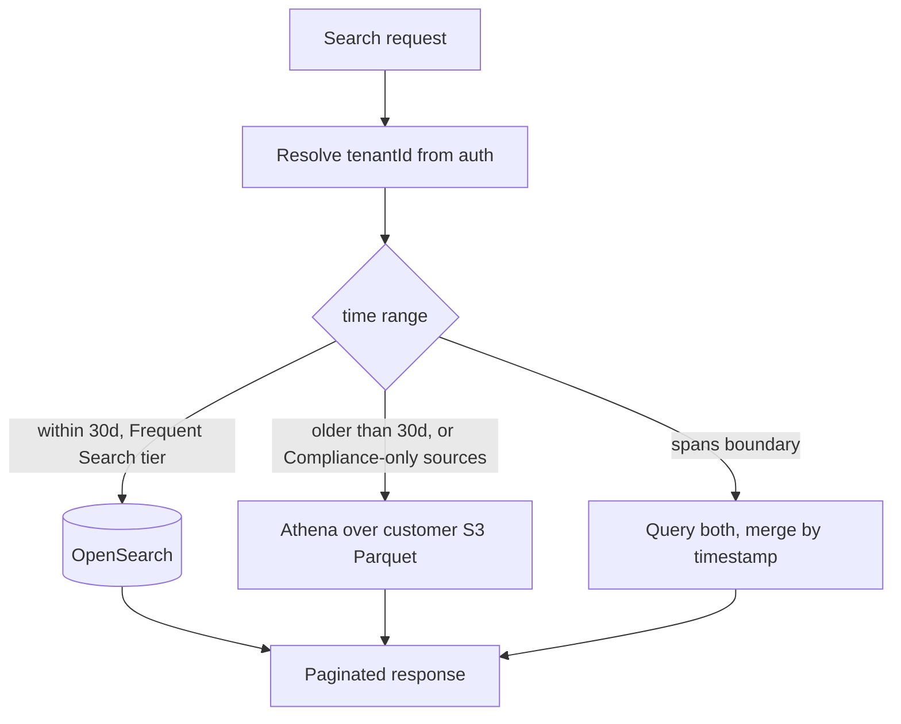
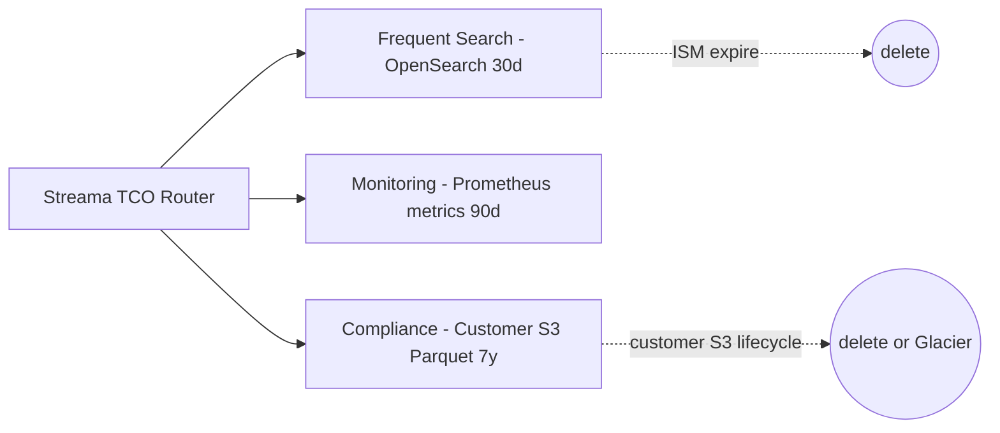

# Audit Trail System — High-Level Design

Internal multi-tenant platform to capture, store, and query structured audit events from many services. Architecturally modelled on **Coralogix**: an **in-stream processing engine** (our "Streama") that parses, enriches, alerts, and **TCO-routes** every event into one of three tiers (**Frequent Search**, **Monitoring**, **Compliance**) before any storage is written. Long-term data lives in the customer's own S3 bucket and is queried in place via **Archive Query**.

---

## 1. Goals, non-goals, scale assumptions

### Goals
- Ingest **structured audit events** (`tenantId`, `userId`, `action`, `resource`, `outcome`, `metadata`, …) from many internal services.
- **Multi-tenant SaaS** isolation — no tenant can ever see another tenant's events.
- **In-stream processing**: parse, enrich, alert, and tier-route **before** indexing — same model as Coralogix Streama. Avoids the "index everything to query/alert on it" cost trap.
- **TCO control** per-tenant per-source: send each event class to the cheapest tier that satisfies its access pattern.
- **Fast querying** across users, event types, and time ranges (sub-minute freshness on Frequent Search).
- **Rich alerting** (Coralogix-style taxonomy: Standard, Ratio, Time-Relative, Unique Count, New Value, Flow).
- **Long-term retention and export** (7y compliance, stored in customer S3, queryable via Archive Query, exportable via signed URL).
- **Live Tail** — real-time WebSocket stream of matching events for ops debugging.

### Non-goals
- APM / general application logging (separate platform — though the Streama design would extend to it).
- A full reimplementation of Coralogix DataPrime; we expose a Lucene-style filter plus a small DataPrime-like DSL for power users.
- UI (separate effort).

### Scale assumptions
| Dimension | Target |
|---|---|
| Sustained ingest | 50k+ events/sec |
| Peak ingest | 150k events/sec (3x burst) |
| Tenants | 1,000s |
| Sources per tenant | 10s |
| Event size | ~1 KB avg, 10 KB max |
| Query freshness (Frequent Search) | seconds to ~1 min |
| Frequent Search retention | 30 days (interactive) |
| Monitoring retention | 90 days of metrics (no events) |
| Compliance retention | 7 years in customer S3 |
| Query latency p95 | < 1s Frequent Search, < 30s Archive Query |

### Multi-tenancy model
**Logical isolation** — `tenantId` is required on every record and enforced in four layers:
1. **API auth** binds the caller to a single `tenantId`; the API never accepts a `tenantId` parameter that disagrees with the auth context.
2. **Stream partition key** is `tenantId`, preserving per-tenant ordering and enabling per-tenant throttling.
3. **Storage routing** — Frequent Search index name and Compliance S3 prefix both include `tenantId`.
4. **IAM** — Compliance archive lives in the customer's own bucket, accessed via an assumed cross-account role scoped to that tenant.

---

## 2. High-level architecture

The architecture is intentionally Coralogix-shaped: producers → Ingestion → **Streama engine** (parse, enrich, alert, route) → three tiers (Frequent Search, Monitoring, Compliance) → Query APIs (Search API + Archive Query) and Live Tail.



### Ingest sequence



### Query routing



---

## 3. Major service interfaces & class definitions

All interfaces are TypeScript signatures only.

### 3.1 Core domain model

```typescript
type AuditEvent = {
  eventId: string;                  // ULID, idempotency key, client-generated
  tenantId: string;
  timestamp: string;                // ISO-8601, server-stamped on ingest
  clientTimestamp?: string;
  source: string;                   // "api-gateway", "billing", ...
  actor: {
    type: "user" | "service" | "system";
    id: string;
    ip?: string;
    userAgent?: string;
  };
  action: string;                   // "user.login", "invoice.paid"
  resource?: { type: string; id: string };
  outcome: "success" | "failure";
  severity: "info" | "warn" | "critical";
  metadata: Record<string, unknown>;
  schemaVersion: number;

  // Populated by Streama:
  parsed?: Record<string, unknown>;   // fields extracted from raw text by parsing rules
  enriched?: Record<string, unknown>; // GeoIP, lookup-table results, derived fields
  tier?: "FrequentSearch" | "Monitoring" | "Compliance"; // set by TCO Router
};

type ServiceAuthContext = {
  tenantId: string;
  serviceName: string;
  scopes: ReadonlyArray<
    | "events:write"
    | "events:read"
    | "rules:admin"          // alert rules
    | "parsing:admin"        // parsing rules
    | "tco:admin"            // routing rules
    | "livetail:read"
  >;
};

type ValidationResult =
  | { ok: true }
  | { ok: false; errors: Array<{ path: string; message: string }> };

type IngestAck = { accepted: number; rejected: Array<{ eventId: string; reason: string }> };

type AuditQuery = {
  from: string;
  to: string;
  filters?: {
    actorId?: string;
    action?: string | string[];
    source?: string | string[];
    severity?: Array<"info" | "warn" | "critical">;
    resourceType?: string;
    resourceId?: string;
    outcome?: "success" | "failure";
    tier?: Array<"FrequentSearch" | "Compliance">;
  };
  q?: string;                       // Lucene-style free text
  dataprime?: string;               // DataPrime-style pipeline expression (power users)
  cursor?: string;
  limit?: number;                   // default 100, max 1000
};

type Page<T> = { items: T[]; nextCursor?: string };

type ExportJob = {
  id: string;
  tenantId: string;
  status: "queued" | "running" | "succeeded" | "failed";
  format: "csv" | "jsonl" | "parquet";
  query: AuditQuery;
  downloadUrl?: string;             // signed URL when succeeded
  expiresAt?: string;
  error?: string;
};
```

### 3.2 Ingestion path

```typescript
interface IIngestionService {
  ingest(events: AuditEvent[], ctx: ServiceAuthContext): Promise<IngestAck>;
}

interface IEventValidator {
  validate(e: AuditEvent): ValidationResult;
}

interface IStreamWriter {
  // Buffered Kinesis producer; resolves once records are durable.
  write(events: AuditEvent[]): Promise<void>;
}

interface ISchemaRegistry {
  getLatestVersion(source: string): Promise<number>;
  validateAgainstSchema(e: AuditEvent): ValidationResult;
}
```

### 3.3 Streama engine (in-stream processing)

The Streama engine is the heart of the system — same role as Coralogix's Streama. **One** consumer reads each shard and runs the full pipeline; it does not write to storage and then re-read.

```typescript
interface IStreamaEngine {
  // Called per Kinesis batch. Returns nothing; side effects: tier writes + notifications.
  process(batch: AuditEvent[]): Promise<void>;
}

// Pipeline stages, applied in order:

interface IParsingRule {
  id: string;
  tenantId: string;
  source: string;                   // applies only to events from this source
  kind: "regex" | "json" | "grok" | "kv";
  expression: string;               // e.g. regex with named groups
  target: "parsed";                 // always writes into AuditEvent.parsed
  enabled: boolean;
}
interface IParsingEngine {
  apply(e: AuditEvent, rules: IParsingRule[]): AuditEvent;
}

interface IEnrichmentRule {
  id: string;
  tenantId: string;
  kind: "geoip" | "lookup" | "constant" | "derived";
  // geoip: input = field path holding an IP (e.g. "actor.ip"), output written to enriched.geo
  // lookup: customer-uploaded CSV/JSON keyed by some field, joined onto enriched.<name>
  // derived: small expression (e.g. "metadata.amount > 1000 ? 'high' : 'low'")
  spec: Record<string, unknown>;
  enabled: boolean;
}
interface IEnrichmentEngine {
  apply(e: AuditEvent, rules: IEnrichmentRule[]): Promise<AuditEvent>;
}

interface ITcoRoutingRule {
  id: string;
  tenantId: string;
  // Match: pick events for this rule
  match: {
    source?: string | string[];
    action?: string | string[];
    severity?: Array<"info" | "warn" | "critical">;
  };
  // Decision: which tier to send to
  tier: "FrequentSearch" | "Monitoring" | "Compliance";
  // Priority: lower number wins if multiple rules match; default rule always last
  priority: number;
  enabled: boolean;
}
interface ITcoRouter {
  decide(e: AuditEvent, rules: ITcoRoutingRule[]): "FrequentSearch" | "Monitoring" | "Compliance";
}
```

### 3.4 Alerting (Coralogix-style taxonomy)

```typescript
type AlertKind =
  | { type: "standard"; minCount: number; windowSec: number; groupBy?: string[] }
  // Coralogix "ratio" alert: ratio of two filter counts in a window
  | { type: "ratio"; numerator: EventFilter; denominator: EventFilter; minRatio: number; windowSec: number }
  // "time relative": compare current window to same window N days ago
  | { type: "time_relative"; filter: EventFilter; windowSec: number; relativeWindow: "1d" | "7d"; deltaPct: number }
  // "unique count": distinct values of a field exceed threshold
  | { type: "unique_count"; filter: EventFilter; field: string; minUnique: number; windowSec: number }
  // "new value": a previously-unseen value appears in a field
  | { type: "new_value"; filter: EventFilter; field: string; learnWindowDays: number }
  // "flow": multi-stage sequence (e.g. failed login -> password reset within N minutes)
  | { type: "flow"; stages: FlowStage[]; withinSec: number; groupBy: string[] };

type EventFilter = Partial<{
  source: string | string[];
  action: string | string[];
  severity: Array<"info" | "warn" | "critical">;
  outcome: "success" | "failure";
  actorType: "user" | "service" | "system";
}>;

type FlowStage = { id: string; filter: EventFilter };

type NotificationTarget =
  | { kind: "webhook"; url: string; secret: string }
  | { kind: "email"; to: string[] }
  | { kind: "slack"; webhookUrl: string }
  | { kind: "pagerduty"; integrationKey: string }
  | { kind: "opsgenie"; apiKey: string; team: string };

interface IAlertRule {
  id: string;
  tenantId: string;
  name: string;
  enabled: boolean;
  kind: AlertKind;
  notify: NotificationTarget[];
  cooldownSec?: number;             // suppress re-fire for the same groupKey
  createdAt: string;
  updatedAt: string;
}

type AlertTriggered = {
  ruleId: string;
  tenantId: string;
  firedAt: string;
  matchedEventIds: string[];
  groupKey?: string;
  context: Record<string, unknown>; // counts, ratios, unique values, etc.
};

interface IAlertRuleStore {
  list(tenantId: string): Promise<IAlertRule[]>;
  get(tenantId: string, ruleId: string): Promise<IAlertRule | null>;
  upsert(rule: IAlertRule): Promise<IAlertRule>;
  delete(tenantId: string, ruleId: string): Promise<void>;
}

interface IAlertEvaluator {
  // Pure in-stream evaluation; state for windows/counts held in DynamoDB AlertWindowState.
  evaluate(batch: AuditEvent[]): Promise<AlertTriggered[]>;
}

interface INotificationDispatcher {
  dispatch(alert: AlertTriggered, targets: NotificationTarget[]): Promise<void>;
}
```

### 3.5 Query, archive, and live tail

```typescript
interface ISearchService {
  // Frequent Search tier; OpenSearch under the hood.
  search(tenantId: string, q: AuditQuery): Promise<Page<AuditEvent>>;
  getById(tenantId: string, eventId: string): Promise<AuditEvent | null>;
}

interface IArchiveQueryService {
  // Compliance tier; Athena over customer-owned S3 Parquet.
  search(tenantId: string, q: AuditQuery): Promise<Page<AuditEvent>>;
  export(tenantId: string, q: AuditQuery, fmt: "csv" | "jsonl" | "parquet"): Promise<ExportJob>;
  getExport(tenantId: string, jobId: string): Promise<ExportJob | null>;
}

interface IUnifiedQueryService {
  // Picks Search vs Archive vs both, merges results.
  search(tenantId: string, q: AuditQuery): Promise<Page<AuditEvent>>;
}

interface ILiveTailHub {
  // WebSocket subscription with a server-side filter; backpressure via per-conn queue + drop policy.
  subscribe(tenantId: string, filter: EventFilter, onEvent: (e: AuditEvent) => void): Subscription;
}

type Subscription = { close(): void };
```

### 3.6 Lifecycle and config

```typescript
interface IRetentionManager {
  // Applies ISM transitions in OpenSearch + S3 lifecycle rules in the customer bucket
  // per the tenant's policy.
  applyLifecycle(): Promise<void>;
}

interface ITenantConfigStore {
  get(tenantId: string): Promise<TenantConfig>;
  put(cfg: TenantConfig): Promise<void>;
}

type TenantConfig = {
  tenantId: string;
  retention: { frequentSearchDays: number; monitoringDays: number; complianceYears: number };
  rateLimit: { eventsPerSec: number };
  archive: {
    // Bring-your-own-bucket. If undefined, falls back to our managed bucket.
    customerBucket?: { roleArn: string; bucket: string; prefix: string; kmsKeyArn?: string };
  };
  exportEnabled: boolean;
};
```

### 3.7 SDK (producer side)

```typescript
// @audit/sdk - thin client used by every producing service.
interface AuditClient {
  emit(event: Omit<AuditEvent, "eventId" | "timestamp" | "schemaVersion" | "parsed" | "enriched" | "tier">): void;
  flush(): Promise<void>;
}

type AuditClientConfig = {
  endpoint: string;
  apiKey: string;                   // service credential, mapped to tenantId server-side
  source: string;                   // pinned at construction
  batch?: { maxEvents: number; maxLatencyMs: number };  // defaults 500 / 50ms
  retry?: { maxAttempts: number; baseDelayMs: number }; // defaults 5 / 100ms
};
```

---

## 4. API outlines

All endpoints are versioned under `/v1`. Auth required everywhere; tenant always resolved from auth context.

### 4.1 Ingestion API

| Method | Path | Purpose |
|---|---|---|
| `POST` | `/v1/events` | Ingest a single event |
| `POST` | `/v1/events:batch` | Ingest up to 500 events |

- **Auth**: service API key (HMAC) or AWS SigV4 → `events:write` scope.
- **Idempotency**: dedupe on `eventId` (ULID). Re-submits within 24h are no-ops.
- **Server-stamped**: `timestamp`, `actor.ip`, `source` (cross-checked against credential).
- **Limits**: 500 events or 5 MB per batch; per-tenant rate limit in `TenantConfig`.
- **Response**: `202 Accepted` with `IngestAck`. Validation failures are per-event.

```http
POST /v1/events:batch
Authorization: Bearer <service-jwt>
Content-Type: application/json

{ "events": [ { "eventId": "01HXYZ...", "action": "user.login",
                "actor": { "type": "user", "id": "u_123" },
                "outcome": "success", "severity": "info",
                "metadata": { "mfa": true } } ] }

HTTP/1.1 202 Accepted
{ "accepted": 1, "rejected": [] }
```

### 4.2 Search & Archive Query API

| Method | Path | Purpose |
|---|---|---|
| `GET` | `/v1/events` | Unified search (Frequent Search + Archive, auto-routed) |
| `GET` | `/v1/events/{eventId}` | Fetch a single event |
| `POST` | `/v1/archive/query` | Explicitly target Archive (DataPrime or SQL) |
| `POST` | `/v1/exports` | Async export job (from Archive) |
| `GET` | `/v1/exports/{jobId}` | Poll export job |

- **Auth**: `events:read`.
- **Query string** on `GET /v1/events`: `from`, `to` (required), `actorId`, `action`, `source`, `severity`, `outcome`, `resourceType`, `resourceId`, `q` (Lucene), `dataprime` (DataPrime-style), `cursor`, `limit`.
- **Routing**:
  - Range within 30d **and** matching tier is FrequentSearch → OpenSearch.
  - Range older than 30d, or source tier-routed to Compliance → Athena.
  - Spans boundary → both, merged by `timestamp` desc.
- **Pagination**: opaque cursor (base64 of `{searchAfter, backend}`), stable ~5 minutes.
- **Export**: returns `ExportJob`; backed by Athena `CTAS` to a per-tenant export prefix; signed download URL valid 1h.

### 4.3 Alert Rules API

| Method | Path | Purpose |
|---|---|---|
| `GET` | `/v1/alert-rules` | List rules |
| `POST` | `/v1/alert-rules` | Create a rule (any `AlertKind`) |
| `GET` | `/v1/alert-rules/{ruleId}` | Get rule |
| `PATCH` | `/v1/alert-rules/{ruleId}` | Update (`enabled`, `notify`, `kind`, `cooldownSec`) |
| `DELETE` | `/v1/alert-rules/{ruleId}` | Delete |
| `POST` | `/v1/alert-rules:simulate` | Dry-run against last N hours of Frequent Search data |

- **Auth**: `rules:admin`.
- **Validation**: `windowSec` capped at 1h; flow `withinSec` capped at 24h; notification targets validated (URL reachable, email format, PagerDuty key non-empty).
- **Simulate**: returns matched event IDs and would-have-fired counts; no notifications dispatched.
- **Audit-of-audit**: every CUD on rules emits an event into the system itself.

### 4.4 Parsing Rules API

| Method | Path | Purpose |
|---|---|---|
| `GET` | `/v1/parsing-rules` | List parsing rules for the tenant |
| `POST` | `/v1/parsing-rules` | Create regex/json/grok/kv rule |
| `PATCH` | `/v1/parsing-rules/{ruleId}` | Update |
| `DELETE` | `/v1/parsing-rules/{ruleId}` | Delete |
| `POST` | `/v1/parsing-rules:test` | Run rule against sample events, return parsed output |

- **Auth**: `parsing:admin`. Same shape as Coralogix's parsing-rules UI.

### 4.5 TCO Routing API

| Method | Path | Purpose |
|---|---|---|
| `GET` | `/v1/tco-routes` | List routing rules (ordered by priority) |
| `POST` | `/v1/tco-routes` | Add a rule (match → tier) |
| `PATCH` | `/v1/tco-routes/{ruleId}` | Update (`match`, `tier`, `priority`, `enabled`) |
| `DELETE` | `/v1/tco-routes/{ruleId}` | Delete |
| `GET` | `/v1/tco-routes/preview` | Replay the last 1h sample against current rules; return tier distribution |

- **Auth**: `tco:admin`.
- **Default rule**: an implicit lowest-priority "→ FrequentSearch" rule guarantees no event is silently dropped.

### 4.6 Live Tail API

- `GET /v1/live-tail` (WebSocket upgrade), query params: `source`, `action`, `actorId`, `severity`, `q`.
- **Auth**: `livetail:read`.
- **Backpressure**: server-side ring buffer per connection; on overflow it drops oldest and sends a `{ "type": "lag", "dropped": N }` control frame.
- **Limits**: max 5 concurrent live-tail sockets per tenant; auto-close after 30 min of inactivity.

---

## 5. Storage & indexing model (the TCO Optimizer)

Three tiers, each optimized for a different access pattern. This is the same trio Coralogix exposes.



### 5.1 Frequent Search tier — OpenSearch (0–30 days)

- **Purpose**: low-latency interactive search, alert evaluator lookback joins, Live Tail history seek.
- **Index pattern**: `audit-{tenantBucket}-{yyyy.MM.dd}` where `tenantBucket = hash(tenantId) % N`.
  - Bucketing bounds shard count across 1000s of tenants (one index per tenant per day would blow up the cluster).
  - Custom routing pins a tenant to its bucket; queries always filter by `tenantId` so only one bucket is hit.
- **Mappings** (key fields):

  | Field | Type | Notes |
  |---|---|---|
  | `eventId` | keyword | `_id` of the document |
  | `tenantId` | keyword | required filter on every query |
  | `timestamp` | date | sort field |
  | `source` | keyword | |
  | `actor.type` | keyword | |
  | `actor.id` | keyword | |
  | `actor.ip` | ip | |
  | `action` | keyword | |
  | `resource.type` | keyword | |
  | `resource.id` | keyword | |
  | `outcome` | keyword | |
  | `severity` | keyword | |
  | `tier` | keyword | |
  | `metadata` | flattened | up to 1k sub-fields |
  | `parsed` | flattened | populated by parsing rules |
  | `enriched` | flattened | populated by enrichment |

- **Sharding**: 6 primary shards per index, 1 replica. Force-merge to 1 segment after rollover.
- **ISM**: hot → read-only at 1d (force-merge) → delete at 30d.
- **Effective composite indexes**:
  - `(tenantId, timestamp)` — time-range scans
  - `(tenantId, actor.id, timestamp)` — "what did this user do?"
  - `(tenantId, action, timestamp)` — "all logins last hour"
  - `(tenantId, resource.type, resource.id, timestamp)` — "history of this resource"

### 5.2 Monitoring tier — Prometheus / managed AMP (0–90 days)

- **Purpose**: cheap, queryable for dashboards and threshold alerts when **the events themselves don't need to be stored** — only their counts.
- **What's stored**: time-series counters and histograms emitted by the Streama engine, labelled with `tenantId`, `source`, `action`, `outcome`, `severity`.
- **What's NOT stored**: the event bodies. This is the TCO win — for high-volume noisy sources (e.g. `health.check`) the tenant pays for one metric data point per minute instead of millions of indexed documents.
- **Retention**: 90 days of metrics.
- **Queries**: PromQL via Grafana; not exposed through the Search API.

### 5.3 Compliance tier — Customer-owned S3 + Athena (0–7 years, BYOB)

- **Purpose**: cost-efficient long-term retention with in-place query (Coralogix "Archive Query"). Customer owns the bucket → the data never leaves their account.
- **Layout**: `s3://<customer-bucket>/<prefix>/tenantId=<id>/year=<yyyy>/month=<MM>/day=<dd>/hour=<HH>/part-*.parquet`
- **Bring-your-own-bucket setup**:
  - Customer creates an IAM role granting our service-account `s3:PutObject`/`GetObject`/`ListBucket` on their prefix and `kms:Decrypt`/`kms:GenerateDataKey` on their CMK.
  - Tenant config stores `roleArn`; Streama and Athena assume it per request.
  - If a tenant doesn't BYOB, data falls back to our managed bucket with the same layout.
- **Partitioning**: Hive-style; **Athena partition projection** declared on the Glue table (no crawler).
- **Written by**: Streama → Kinesis Firehose with dynamic partitioning on `tenantId` and timestamp; buffer 128 MB / 60s; JSON → Parquet via Glue schema.
- **Compaction**: nightly Lambda merges small files per partition to ~256 MB targets (improves Athena scan cost).
- **Indexing**: Parquet column statistics + partition pruning. No secondary index — queries always pin `tenantId` and date range, so partition pruning does the heavy lifting.
- **Cold transition**: managed by the **customer's** S3 lifecycle rules — they can move to Glacier or Deep Archive on their own schedule. We surface a recommended policy in the tenant config UI but never delete from a customer bucket.

### 5.4 Configuration store — DynamoDB

Operational metadata (tiny vs. event volume) lives in DynamoDB for single-digit-ms reads.

| Table | PK | SK | Notes |
|---|---|---|---|
| `Tenants` | `tenantId` | — | `TenantConfig` (incl. BYOB role ARN) |
| `IngestKeys` | `tenantId` | `keyId` | API keys, hashed secret, scopes |
| `AlertRules` | `tenantId` | `ruleId` | `IAlertRule` records |
| `ParsingRules` | `tenantId` | `ruleId` | `IParsingRule` records |
| `EnrichmentRules` | `tenantId` | `ruleId` | `IEnrichmentRule` records |
| `TcoRoutes` | `tenantId` | `priority#ruleId` | Ordered routing decisions |
| `SchemaRegistry` | `source` | `version` | JSON Schema per source/version |
| `ExportJobs` | `tenantId` | `jobId` | `ExportJob` state, TTL 7d |
| `AlertWindowState` | `tenantId#ruleId` | `windowStart` | Counters / unique sets / flow state; TTL = window |
| `NewValueSeen` | `tenantId#ruleId#field` | `value` | "New Value" learning set; TTL = learn window |

All tables on-demand capacity to absorb tenant spikes without provisioning.

### 5.5 Why this storage split

| Need | Tier that serves it | Why not the others |
|---|---|---|
| "Show last hour of failed logins" | Frequent Search | Athena ~10s; Monitoring has counts not events |
| "Alert on 100 health checks/sec" | Monitoring | Indexing every check is wasteful; counters are enough |
| "Compliance: prove who accessed record X in 2024" | Archive Query → S3 | OpenSearch too expensive at 1y; Glacier needs restore |
| "Keep 7y cheaply in customer's account" | Customer S3 + Glacier lifecycle | We never want to hold compliance data long-term |
| "Tenant config + alert rules" | DynamoDB | Streaming stores wrong shape; needs point reads |

---

## 6. Cross-cutting concerns

### Multi-tenant isolation
Defense in depth: auth context → Kinesis shard key → per-tenant index/prefix → cross-account IAM role for Compliance archive. The API surface offers no parameter that lets a caller specify a different `tenantId` than their auth context.

### Backpressure and ordering
- Kinesis shard key = `tenantId` → per-tenant ordering preserved; one noisy tenant cannot disorder others.
- Per-tenant token bucket at the Ingestion API (`TenantConfig.rateLimit.eventsPerSec`) returns `429` + `Retry-After` before reaching Kinesis.
- Streama engine uses Kinesis enhanced fan-out + checkpointing; failed records go to per-stage DLQs (SQS) with replay tooling.

### Idempotency and exactly-once-ish delivery
- `eventId` is the dedupe key end to end. OpenSearch `_id = eventId` makes Frequent Search idempotent.
- Compliance path is at-least-once into S3; an Athena view dedupes via `ROW_NUMBER() OVER (PARTITION BY eventId ORDER BY ingestTime)` if measured duplicates become material. In practice Firehose duplicates are rare and most queries are aggregate-tolerant.

### Schema evolution
- `schemaVersion` on every event; schemas stored in DynamoDB `SchemaRegistry`.
- **Only backwards-compatible additive changes**: new optional fields are allowed; renames/removals require a new `source` namespace or a major bump with dual-write.
- Validator looks up the schema for `{source, schemaVersion}` and rejects with a structured error.

### Security
- **Transport**: TLS 1.2+; mTLS optional for high-security services.
- **At rest**: KMS-encrypted OpenSearch, S3 (SSE-KMS), DynamoDB, Kinesis. Customer-owned KMS keys supported for Compliance bucket (BYOK on top of BYOB).
- **Auth**: service-to-service via signed JWT (short TTL, daily rotation) or SigV4; user access via internal SSO.
- **Audit-of-audit**: every admin action (rules, parsing, routing, exports) is emitted as an event into the system itself, source `audit-trail-system`.
- **PII**: producers MUST NOT put raw PII in `metadata`. Validator runs a configurable regex/denylist (emails, SSNs, credit cards) and rejects matches.

### Observability
CloudWatch metrics & alarms:
- Ingestion API: 5xx rate, p95 latency, per-tenant `429`s.
- Kinesis: `IncomingRecords`, `WriteProvisionedThroughputExceeded`, consumer `IteratorAgeMilliseconds` (page if > 60s).
- Streama: per-stage latency (parse, enrich, alert, route), TCO distribution per tenant (% to each tier), parsing rule error rate.
- Search API: p95 latency by backend, Athena scan bytes per query.
- Alert Evaluator: rule eval latency, fired-alert count per rule (anomaly detection on this).

Structured logs everywhere carry `tenantId`, `eventId`, `requestId`.

### Cost controls
- The TCO Optimizer **is** the cost control: per-tenant per-source routing keeps high-volume noise out of OpenSearch entirely.
- Athena workgroup with `MaxBytesScanned` per tenant prevents runaway Archive queries.
- Compliance bucket lifecycle is the customer's responsibility, which both lowers our cost and gives them control.

---

## 7. Coralogix mapping cheat sheet

Use this when explaining the system in Coralogix terms:

| Our component | Coralogix concept |
|---|---|
| Ingestion API | Coralogix Ingress (`api.coralogix.com/logs/v1/...`) |
| `@audit/sdk` | Coralogix logger SDKs (`coralogix-logger-node`, etc.) |
| Kinesis Data Streams | Internal event bus feeding Streama |
| **Streama Engine** | **Streama** (in-stream parse / enrich / alert / route before indexing) |
| Parsing Rules API | Coralogix **Parsing Rules** (regex/JSON/grok/kv) |
| Enrichment Engine | Coralogix **Enrichments** (GeoIP, custom lookup tables) |
| TCO Router + `/v1/tco-routes` | Coralogix **TCO Optimizer** |
| Frequent Search tier (OpenSearch) | Coralogix **Frequent Search** priority |
| Monitoring tier (Prometheus) | Coralogix **Monitoring** priority (metrics-only, no log storage) |
| Compliance tier (customer S3 + Athena) | Coralogix **Compliance** priority + **Archive Query** |
| Alert Evaluator with 6 `AlertKind`s | Coralogix **Alerts**: Standard / Ratio / Time-Relative / Unique Count / New Value / Flow |
| Live Tail WebSocket | Coralogix **Live Tail** |
| Search API `q` + `dataprime` | Coralogix Lucene / **DataPrime** |
| BYOB customer S3 with assumed role | Coralogix **Archive in customer's S3** |
| DynamoDB config tables | Coralogix internal account/team/rule storage |

**One-sentence elevator pitch**: "It's a Coralogix-shaped pipeline for audit events — the Ingestion API drops events into a stream, the Streama engine parses, enriches, evaluates alerts, and routes each event to one of three tiers (Frequent Search for interactive query, Monitoring for cheap metric-only counting, Compliance for long-term storage in the customer's own S3 bucket), and a unified Search API serves Frequent Search and Archive Query transparently."

---

## 8. Open questions / future work

- **ML anomaly detection** on top of the alert taxonomy (OpenSearch AD plugin or external service).
- **DataPrime parity**: how far we go in implementing Coralogix's full pipeline language vs. a curated subset.
- **Cross-region DR**: Kinesis cross-region replication; OpenSearch snapshot-restore; customer S3 already cross-region replicable on their side.
- **Customer-managed KMS keys** for the Frequent Search tier (currently BYOK only for Compliance bucket).
- **Streaming joins** for richer Flow alerts — would move Streama from Lambda to Kinesis Data Analytics / Flink.
- **gRPC ingestion** for very high-volume internal callers.
