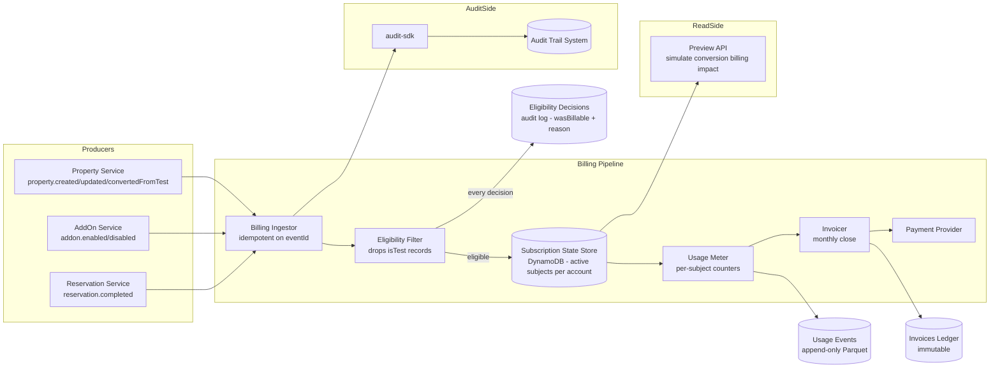
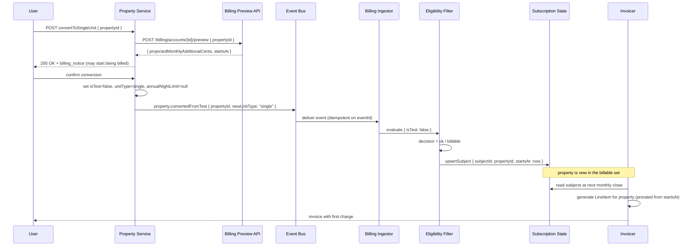

# Billing System — High-Level Overview
---

## What it does

Usage-based billing for a property-management SaaS: every **active, billable property** and
**enabled add-on** under an account contributes to a monthly invoice. The system enforces a single
eligibility rule — **test properties are never billable** — so that internal QA, onboarding, and
integration-testing units do not accrue charges or skew financial metrics.

The flow is always the same:

```
property/addon/reservation event
  → Billing Ingestor
    → Eligibility Filter (drops isTest events)
      → Subscription State (live set of billable subjects)
        → Usage Meter (per-subject counters)
          → Invoicer (monthly close)
            → Payment Provider
```

Conversion of a Test property to Single-Unit or Sub-Unit is the monetization moment: only after
`property.convertedFromTest` fires does the property enter the billable subject set.

---

## 1. High-level architecture



**In words:**

1. All domain events flow into the **Billing Ingestor**, which deduplicates on `eventId` before any processing.
2. The **Eligibility Filter** is the single chokepoint: it reads `isTest` from the event payload and writes every decision (billable or not) to the `eligibility_decisions` audit log so Finance can always answer "why wasn't this billed?".
3. Eligible events update the **Subscription State Store** — the live set of `BillableSubject` records per account.
4. The **Usage Meter** reads state to maintain per-subject counters in the `usage_events` log.
5. The **Invoicer** closes the period monthly, reading usage, producing an immutable `Invoice`, and charging the **Payment Provider**.
6. Every billing action is also emitted to the **Audit Trail** via `audit-sdk` (see [audit-trail-overview.md](audit-trail-overview.md)).

---

## 2. Major service interfaces

Just the types and signatures — implementations are out of scope.

### Core domain model

```typescript
type BillableSubject = {
  accountId: string;
  subjectType: "property" | "addon";
  subjectId: string;          // propertyId or addonId
  planId: string;
  startsAt: string;           // ISO-8601; set to event timestamp on convertedFromTest
  endsAt?: string;            // set when property is archived or addon disabled
};

type Invoice = {
  invoiceId: string;
  accountId: string;
  periodStart: string;
  periodEnd: string;
  lineItems: LineItem[];
  totalCents: number;
  currency: string;
  status: "draft" | "finalized" | "paid" | "failed";
  createdAt: string;
};

type LineItem = {
  subjectId: string;
  subjectType: "property" | "addon";
  description: string;
  quantity: number;           // nights, months, events, etc.
  unitPriceCents: number;
  totalCents: number;
};

type EligibilityDecision = {
  eventId: string;
  accountId: string;
  subjectId: string;
  wasBillable: boolean;
  reason: "isTest" | "plan-excluded" | "no-active-plan" | "ok";
  decidedAt: string;
};
```

### Eligibility Filter

```typescript
// Single chokepoint — called for every inbound event before touching Subscription State.
interface IEligibilityRule {
  isBillable(event: {
    subjectId: string;
    accountId: string;
    isTest: boolean;
    addonKind?: string;
  }): { billable: boolean; reason: EligibilityDecision["reason"] };
}
```

### Subscription State Store

```typescript
interface ISubscriptionStateStore {
  get(accountId: string): Promise<BillableSubject[]>;
  upsertSubject(subject: BillableSubject): Promise<void>;
  endSubject(accountId: string, subjectId: string, endsAt: string): Promise<void>;
}
```

### Usage Meter

```typescript
interface IUsageMeter {
  record(subjectId: string, metric: string, qty: number, at: string): Promise<void>;
  getPeriod(subjectId: string, period: string): Promise<{ metric: string; total: number }[]>;
}
```

### Invoicer

```typescript
interface IInvoicer {
  // Idempotent on (accountId, periodEnd). Safe to retry on failure.
  closePeriod(accountId: string, periodEnd: string): Promise<Invoice>;
  getInvoice(accountId: string, invoiceId: string): Promise<Invoice | null>;
  listInvoices(accountId: string): Promise<Invoice[]>;
}
```

### Preview Service

```typescript
// Powers the "may start being billed" warning shown on Test → Single-Unit conversion (US9/14).
interface IPreviewService {
  simulateConversion(
    accountId: string,
    propertyId: string,
    newUnitType: "single" | "sub"
  ): Promise<{
    projectedMonthlyAdditionalCents: number;
    affectedPlanId: string;
    startsAt: string;
  }>;
}
```

---

## 3. API outlines

All endpoints under `/v1/billing`. Internal service token required; tenant resolved from auth.
The Preview endpoint is also called by the Property Service to surface the billing notice in the UI.

| Method | Path | Purpose |
|---|---|---|
| `POST` | `/v1/billing/events` | Internal ingestion; idempotent on `eventId`; accepts property/addon/reservation events |
| `GET` | `/v1/billing/accounts/{id}/subjects` | List active `BillableSubject` records; used by Finance / CS |
| `GET` | `/v1/billing/accounts/{id}/invoices` | List invoices for an account |
| `GET` | `/v1/billing/accounts/{id}/invoices/{invoiceId}` | Fetch one invoice |
| `POST` | `/v1/billing/accounts/{id}/preview` | Simulate billing impact of a Test → Single-Unit conversion |
| `GET` | `/v1/billing/eligibility/{subjectId}` | Internal debug: returns the decision log for a subject |

```http
POST /v1/billing/accounts/acc_123/preview
{ "propertyId": "prop_abc", "newUnitType": "single" }

200 OK
{
  "projectedMonthlyAdditionalCents": 4900,
  "affectedPlanId": "plan_pro",
  "startsAt": "2026-05-18T14:00:00Z"
}

---

GET /v1/billing/accounts/acc_123/subjects

200 OK
{ "subjects": [
    { "subjectId": "prop_xyz", "subjectType": "property", "startsAt": "2026-04-01T00:00:00Z" },
    { "subjectId": "addon_aa", "subjectType": "addon",    "startsAt": "2026-03-15T00:00:00Z" }
  ]
}
```

---

## 4. Storage and indexing model

| Store | Technology | Retention | Purpose |
|---|---|---|---|
| `subscription_state` | DynamoDB | Indefinite | Live set of `BillableSubject` per account; point-read by `accountId` |
| `usage_events` | S3 Parquet (via Kinesis Firehose) | 7 years | Append-only counters; partitioned by `accountId / year / month`; replayed to recompute invoices |
| `invoices` | PostgreSQL (or DynamoDB) | 7 years | Immutable ledger; PK `(accountId, periodEnd)`; idempotent upsert |
| `eligibility_decisions` | DynamoDB (TTL 90 days) + cold S3 | 7 years | Every decision; lets Finance query "why wasn't prop_abc billed in May?" |

### `subscription_state` — DynamoDB

| PK | SK | Key fields |
|---|---|---|
| `accountId` | `subjectId` | `subjectType`, `planId`, `startsAt`, `endsAt` |

GSI on `(subjectType, startsAt)` supports finance reporting: "all properties that became billable this month."

### `eligibility_decisions` — DynamoDB

| PK | SK | Key fields |
|---|---|---|
| `subjectId` | `decidedAt` | `eventId`, `wasBillable`, `reason` |

TTL of 90 days for hot access; nightly job copies to `s3://billing-cold/eligibility/` for 7-year compliance.

### `usage_events` — S3 Parquet layout

```
s3://billing-usage/
  accountId=<id>/
    year=<yyyy>/month=<MM>/
      part-0001.parquet
```

Athena partition projection declared on the Glue table (no crawler). Queries always pin
`accountId` and `year/month`, so partition pruning keeps scan cost low.

---

## 5. Cross-cutting concerns

**Idempotency** — the Billing Ingestor deduplicates on `eventId` before any state mutation. The
Invoicer's `closePeriod` is idempotent on `(accountId, periodEnd)` — retrying a failed month-end
close is safe.

**Late-arriving events** — the period close is deferred 48 hours after `periodEnd` to absorb
late events. A reconciliation job compares `subscription_state` against the authoritative
`properties` collection nightly to catch any `isTest` flip that was missed due to event ordering
or delivery failure.

**Test-property invariant** — the `IEligibilityRule` is the only code path that decides
billability. All other billing code treats `BillableSubject` records as ground truth and never
re-reads `isTest`. This means the invariant is enforced once and cannot be bypassed by a later
Subscription State mutation.

**Schema evolution** — `BillableSubject.planId` is a versioned reference. Plan changes are
applied prospectively with a new `startsAt`; past line items are never recomputed (immutable
ledger). A major plan-model change requires a migration script and dual-write period.

**Audit trail** — every billing pipeline action (ingest, eligibility decision, invoice close,
payment) is emitted as an event into the Audit Trail system via `audit-sdk`
(see [audit-trail-overview.md](audit-trail-overview.md)), `source: "billing-service"`.
This gives an independent, tamper-evident log separate from the billing ledger itself.

---

## Cross-domain handoff: Test → Single-Unit conversion (US9)

This is the critical seam between the two systems. Draw this on the whiteboard.



**Key design decisions visible in the diagram:**

1. The Preview call happens **before** the user confirms — the billing impact is shown as a
   warning, not a surprise on the next invoice.
2. The Property Service does not call Billing directly for the state change — it emits an event.
   Billing is a downstream consumer; the two services are decoupled.
3. `startsAt` is set to the event timestamp, so proration is accurate to the minute.
4. Billing never sees `isTest: true` in its subject set — the Eligibility Filter is the wall.

---

## TL;DR

- **One eligibility chokepoint.** `IEligibilityRule.isBillable` is the only place in the system that reads `isTest`. Everything downstream treats `BillableSubject` records as the source of billing truth, so the exclusion cannot be accidentally bypassed.
- **Event-driven decoupling at the monetization moment.** The Property Service emits `property.convertedFromTest`; Billing reacts. The two domains never call each other directly for state changes.
- **Preview before commitment.** The UI calls `POST /billing/accounts/{id}/preview` before the user confirms conversion, so the "may start being billed" notice shows a real projected amount, not boilerplate text.
- **Immutable ledger + audit log.** Invoices are never mutated after finalization; every eligibility decision is recorded separately with its reason, giving Finance a complete audit trail for "why wasn't this property billed?"
