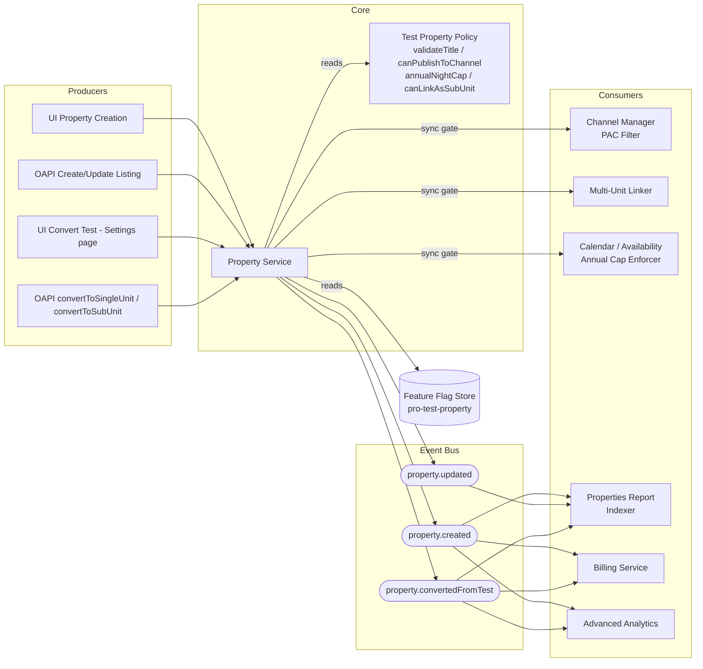

# Test Listings System — High-Level Overview
---

## What it does

Introduces a **Test Property** mode: a single `isTest` flag on a property that activates a
cross-cutting policy bundle — title must contain "TEST", the property is excluded from channel
publishing (except Booking Engine), annual bookable nights are hard-capped at 10, the property
cannot be linked as a Multi-Unit sub-unit, and it is excluded from add-on billing and Advanced
Analytics. The entire feature is gated behind the `pro-test-property` feature flag. A Test property
can be converted to a regular Single-Unit or Sub-Unit at any time, at which point all restrictions
lift and billing may start.

The flow is always the same:

```
producer (UI / OAPI)
  → Property Service (owns isTest, enforces policy)
    → event bus (property.created / property.updated / property.convertedFromTest)
      → consumers (Channel Manager, Linker, Calendar, Report, Billing, Analytics)
```

---

## 1. High-level architecture



**In words:**

1. Every write goes through **Property Service**, which reads the `isTest` flag and runs the **Test Property Policy** before persisting.
2. Sync gating: **Channel Manager PAC**, **Multi-Unit Linker**, and **Calendar** call the Policy at request time to enforce per-operation restrictions.
3. Async consumers — **Billing**, **Advanced Analytics**, **Report Indexer** — subscribe to the event bus; `property.convertedFromTest` is the trigger that opens billing eligibility.
4. The **Feature Flag Store** is the on/off switch; the policy module is a no-op when the flag is off.

---

## 2. Major service interfaces

Just the types and signatures — implementations are out of scope.

### Core domain model

```typescript
type UnitType = "single" | "multi" | "sub" | "complex" | "test";

type Property = {
  propertyId: string;
  accountId: string;
  unitType: UnitType;
  isTest: boolean;                 // immutable after creation except via convert endpoints
  title: string;                   // must contain "TEST" (case-insensitive) when isTest === true
  annualNightLimit?: number;       // 10 when isTest; undefined ("Not Defined") after conversion
  createdAt: string;
  updatedAt: string;
};

type PropertyEvent =
  | { type: "property.created";          propertyId: string; accountId: string; isTest: boolean }
  | { type: "property.updated";          propertyId: string; accountId: string; isTest: boolean; changes: string[] }
  | { type: "property.convertedFromTest"; propertyId: string; accountId: string; newUnitType: "single" | "sub" };
```

### Test Property Policy

```typescript
// Pure module — no I/O; called synchronously in every write path.
interface ITestPolicy {
  // Returns an error message if the title is invalid; null if ok.
  validateTitle(title: string, isTest: boolean): string | null;

  // Returns true if this channel is allowed to show test properties in PAC.
  // Only "booking_engine" returns true.
  canPublishToChannel(channel: string, isTest: boolean): boolean;

  // Returns false when the candidate child property is a test property.
  canLinkAsSubUnit(child: Pick<Property, "isTest">): boolean;

  // Returns the annual night cap: 10 when isTest, undefined otherwise.
  annualNightCapFor(isTest: boolean): number | undefined;
}
```

### Property Service

```typescript
interface IPropertyService {
  create(input: CreatePropertyInput, ctx: AuthContext): Promise<Property>;
  update(propertyId: string, input: UpdatePropertyInput, ctx: AuthContext): Promise<Property>;
  convertTestToSingleUnit(propertyId: string, ctx: AuthContext): Promise<Property>;
  convertTestToSubUnit(propertyId: string, multiUnitId: string, ctx: AuthContext): Promise<Property>;
  listTestProperties(accountId: string): Promise<string[]>;   // returns propertyIds only
}

type CreatePropertyInput = {
  unitType: UnitType;
  isTest?: boolean;
  title: string;
  // ...other fields
};

type UpdatePropertyInput = {
  title?: string;
  // isTest is NOT updatable via update(); use convert endpoints
};
```

### PAC Filter (Channel Manager)

```typescript
// Called by any PAC (Property Assignment Component) before returning its candidate list.
interface IPACFilter {
  // Removes test properties from the list when the channel is not "booking_engine".
  // When channel === "booking_engine", automatic rules still exclude isTest properties
  // unless the user explicitly selects them.
  filter(
    properties: Property[],
    ctx: { channel: string; isAutoRule: boolean }
  ): Property[];
}
```

---

## 3. API outlines

All endpoints under `/v1`. Feature flag `pro-test-property` must be enabled; `updateListing`
permission required for write operations; tenant is resolved from auth token.

| Method | Path | Purpose |
|---|---|---|
| `POST` | `/v1/properties` | Create a property; accepts `isTest: boolean`; validates `TEST` in title when `isTest: true` |
| `PATCH` | `/v1/properties/{id}` | Update property; blocks title save if `TEST` word would be removed on a test property |
| `POST` | `/v1/properties/{id}/descriptions` | Upsert descriptions; validates `TEST` in EN title for test properties |
| `POST` | `/v1/properties-api/testProperties/convertToSingleUnit` | Convert test → single-unit; body: `{ propertyId }` |
| `GET` | `/v1/properties-api/testProperties` | List all test `propertyId`s under the account |

```http
POST /v1/properties
{ "title": "TEST_ Beach House", "unitType": "single", "isTest": true }

201 Created
{ "propertyId": "prop_abc", "isTest": true, "annualNightLimit": 10, ... }

---

POST /v1/properties-api/testProperties/convertToSingleUnit
{ "propertyId": "prop_abc" }

200 OK
{ "propertyId": "prop_abc", "unitType": "single", "isTest": false, "annualNightLimit": null }

Errors:
400  { "error": "'Test' should be part of the title in case of Test properties" }
400  { "error": "Annual night limit of Test properties can't be edited" }
400  { "error": "Annual night limit of Test properties can't be edited" }
```

---

## 4. Storage and indexing model

| Store | Technology | Purpose |
|---|---|---|
| `properties` | MongoDB (existing) | Source of truth; `isTest` indexed as a single-field sparse index |
| `properties_report` | Elasticsearch read model | Powers the Properties Report; `unitTypeFacet` field is `"Test (Single-Unit)"` for test properties |
| `pac_eligibility` | Redis / DynamoDB | Pre-computed per `(channel, propertyId)`; updated on every `property.*` event; makes PAC listing O(1) |

### `properties` collection (key fields)

| Field | Index | Notes |
|---|---|---|
| `propertyId` | PK | |
| `accountId` | compound with `isTest` | Powers `GET /testProperties` and report filter |
| `isTest` | sparse | Only test properties in the index |
| `unitType` | — | |
| `annualNightLimit` | — | Written as `10` on create; set to `null` on conversion |

### `pac_eligibility` denormalized cache

| Key | Value |
|---|---|
| `{channel}:{propertyId}` | `{ eligible: boolean, isTest: boolean }` |

Written by a consumer of the event bus so the Channel Manager PAC never queries `properties` directly.
Invalidated on every `property.created`, `property.updated`, `property.convertedFromTest`.

---

## 5. Cross-cutting concerns

**Feature flag** — `pro-test-property` gates all Test-specific code paths in the API and the Policy module. When the flag is off, `isTest` is rejected on create, and all policy checks skip.

**Permissions** — `updateListing` is required for any write (create, update, convert). Conversion is additionally restricted to properties where `unitType === "test"`.

**Title invariant** — enforced in three places: `POST /v1/properties` on create, `PATCH /v1/properties/{id}` on every title edit, and `POST /v1/properties/{id}/descriptions` on each descriptions upsert. All three delegate to the same `ITestPolicy.validateTitle` call, so the rule is defined once.

**"Moving the cheese" warning** — conversion endpoints (convert → Single-Unit, convert → Sub-Unit) return a `billing_notice` field in the response body warning the caller that billing may start. The UI surfaces this as a confirmation dialog before the user clicks Save.

**Audit trail** — every write to `properties` (create, update, convert) emits an event into the Audit Trail system (`source: "property-service"`, `action: "property.created" | "property.updated" | "property.convertedFromTest"`). See [audit-trail-overview.md](audit-trail-overview.md) for the receiving pipeline.

---

## TL;DR

- **One flag, many policy gates.** `isTest: true` on a property activates five restrictions (title, channels, annual cap, sub-unit linking, billing) that live in a single `ITestPolicy` module called from every relevant code path.
- **Sync gates at the boundary, async events for downstream.** Channel Manager, Multi-Unit Linker, and Calendar enforce restrictions synchronously. Billing, Analytics, and the Report Indexer consume the event bus asynchronously.
- **Conversion is the monetization moment.** `property.convertedFromTest` is the event Billing waits for; nothing is billable before it fires.
- **PAC performance is pre-computed.** The `pac_eligibility` cache keeps channel PAC calls O(1) without hitting the properties database on every property picker load.
